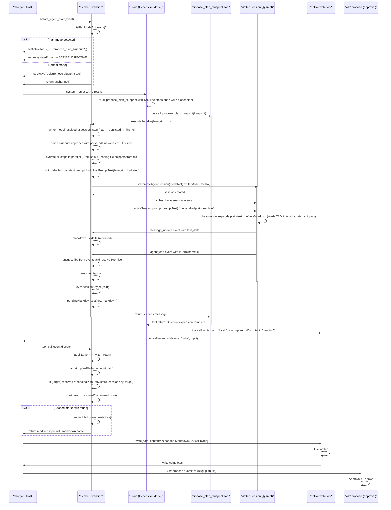
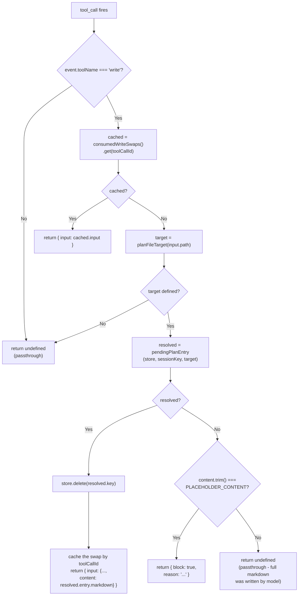

# omp-scribe: Architecture & Patterns

## Overview

**omp-scribe** is a plan-mode cost-reduction extension for oh-my-pi. It splits expensive-model plan authoring into two phases:
1. **Compact phase**: the expensive model emits a compact JSON blueprint whose `approach` steps are dense TAD lines instead of Markdown prose.
2. **Expansion phase**: a cheap model (via nested session) expands those TAD lines — hydrated from disk with the line ranges they reference — into the final Markdown.

The extension then transparently swaps the placeholder `write` call content before disk I/O, so the expensive model never generates the plan body itself.

**Goal**: reduce tokens spent by the expensive model authoring plan-document prose, leaving all other plan-mode mechanics (approval UI, file destination, native workflow) untouched.

---

## Module Map

### `src/types.ts` — Blueprint Shape (42 lines)

Defines the compact blueprint contract the expensive model submits for plan mode, plus the doc-mode outline:

- `PlanBlueprintFile`: `{ path, reason }` — one critical-file anchor
- `PlanBlueprint`: the top-level compact blueprint
  - `slug`: kebab-case identifier (also becomes the plan-file slug)
  - `title`: short title
  - `context`: 2–4 sentence need statement
  - `approach`: ordered array of TAD lines (Tokenized Architectural Diff; see `src/tad.ts`). Each TAD line encodes one change step as `@path/to/file.ext[start-end]{+|!|~}deps(dep/a.ts,dep/b.ts)#snake_case_intent`, where: `@path` is the project-relative file edited, `[start-end]` is the inclusive 1-based line range (omitted for new files), `{+}` adds, `{!}` deletes, `{~}` modifies, `deps(...)` lists dependent file contracts (may be empty), and `#intent` is the snake_case step label.
  - `criticalFiles`: array of `PlanBlueprintFile` (may be empty)
  - `verification`: array of observable checks (non-empty)
  - `assumptions`: array of overridable decisions (may be empty)

**Export**: Two interfaces (`PlanBlueprint`, `PlanBlueprintFile`), no logic. Field names and structure mirror the native plan-document contract (Context, Approach, Critical files, Verification, Assumptions).

---
### `src/tad.ts` — TAD Parsing and Hydration (151 lines)

**Purpose**: Parse Tokenized Architectural Diff (TAD) lines from `PlanBlueprint.approach` and hydrate them with on-disk file content.

**Exports**:
- `TadOperation`: Type alias `"+" | "!" | "~"` for add/delete/modify operations.
- `TadLineRange`: `{ start: number; end: number }` — inclusive 1-based line range.
- `TadStep`: `{ raw: string; filePath: string; lineRange?: TadLineRange; operation: TadOperation; dependencies: string[]; intent: string }` — parsed TAD step.
- `TAD_LINE_RE`: Anchored regex with named capture groups (`path`, `start`, `end`, `op`, `deps`, `intent`). Shared with the tool's Zod schema, so a schema-valid line always parses.
- `TAD_LINE_SHAPE`: Human-readable restatement of the regex (`@path/to/file.ext[start-end]{+|!|~}deps(dep/a.ts,dep/b.ts)#snake_case_intent`); used in tool descriptions and validation errors.
- `parseTadLine(line: string): TadStep` — Parses one TAD line into its parts. Throws a descriptive `Error` if the line does not match the regex or carries an inverted line range (start > end).
- `HydratedTadStep`: `{ step: TadStep; snippet: string }` — A parsed TAD step plus the file content it references.
- `hydrateTadStep(projectRoot: string, step: TadStep): Promise<HydratedTadStep>` — Reads the lines a TAD step references so the writer model can ground its prose in real code. Resolves `step.filePath` against `projectRoot`, refuses paths escaping the project root, reads the file, and returns a 1-based numbered excerpt (e.g., `    1| <line>`). Caps excerpts at 200 lines (`MAX_SNIPPET_LINES`). Never throws: missing files yield `(no snippet: <path> does not exist yet — treat this step as authoring it from scratch)`, ranges past EOF are capped, and a path outside the project root appends an explanatory note.

---


### `src/config.ts` — Flags, Detection, Contracts (75 lines)

**Purpose**: Configuration management, plan-mode detection, path parsing, host-API contracts.

**Exports**:
- `BLUEPRINT_TOOL_NAME = "propose_plan_blueprint"`: tool name (hardcoded everywhere it's needed).
- `PLACEHOLDER_CONTENT = "pending"`: sentinel string; the expensive model writes this literal word to the plan file, then the extension swaps it.

**Host-API contracts** (how the extension detects plan mode and resolves plan files):
- **Plan-mode detection** (`isPlanModeActive(ctx)`, `isPlanModeBranch(branch)`) — scans `ctx.sessionManager.getBranch()` backwards for the first mode-related entry: a `mode_change` entry (from `SessionManager.appendModeChange`, persisted and read back through `buildSessionContext().mode` and the host's `#reconcileModeFromSession` in `modes/interactive-mode.ts`) determines whether plan mode is active (`mode === "plan"`) or inactive (`"plan_paused"`, `"none"`, `"goal"`, `"vibe"`); or a `custom_message` with `customType === "plan-mode-context"` (from `AgentSession.sendPlanModeContext`) means active (covers `--plan-yolo`, which sets plan state in-session without a `mode_change`); or a `custom_message` with `customType === "plan-yolo-handoff"` means inactive; else defaults to false. The plan brief itself is delivered as a hidden `custom_message`, never in `BeforeAgentStartEvent.systemPrompt`.
- **Plan-file resolution** (`planFileTarget(path)`, `pendingPlanEntry(store, sessionKey, target)`) — `planFileTarget()` matches any `local://*plan.md` artifact (case-insensitive extension, stem charset: letters, numbers, underscores, hyphens, per the host's `normalizePlanTitle()`); returns `{ stem, slug }` where `slug` is defined for the canonical `local://<slug>-plan.md` form and undefined for the default `local://PLAN.md` or custom stems. `pendingPlanEntry()` resolves the draft to consume: it tries exact slug match (case-insensitive) first, then `<slug>-plan` stem match, otherwise the session's only pending draft (which allows `local://PLAN.md` and title-derived names to resolve), otherwise undefined (blocking placeholder writes).

**Configuration interface**:
```ts
ScribeConfig {
  brainModel?: string;     // advisory; warns if active model doesn't match
  writerModel: string;     // defaults to "@smol" role
}
```

**Functions**:

| Name | Purpose | Notes |
|------|---------|-------|
| `registerScribeFlags(pi)` | Registers `--scribe-brain-model` and `--scribe-writer-model` CLI flags. Load-time safe. | Called first in factory. |
| `readScribeConfig(pi, cwd)` | Async. Reads current flag values, then the persisted per-project override; returns `ScribeConfig`. | Idempotent. Writer precedence: non-default flag → `.claude/plans/scribe_config.json` → `DEFAULT_WRITER_MODEL`. |
| `readPersistedScribeConfig(cwd)` / `writePersistedScribeConfig(cwd, patch)` | Read/atomically merge the per-project settings file (`/scribe-model` writes it). | Read failures self-heal to `{}`; `writerModel: undefined` deletes the key. |
| `formatScribeStatus(cfg, state)` | Renders the single-line footer text for an `idle`/`doc-armed`/`plan`/`doc`/`failed` state. | Draft states report the resolved `provider/id` and drafted character count. |
| `isPlanModeActive(ctx)` | Wrapper calling `isPlanModeBranch(ctx.sessionManager.getBranch())` with defensive guard for missing `getBranch`. | Detects via session branch; returns false for empty branch, missing context, or inactive modes. |
| `isPlanModeBranch(branch)` | Scans `branch` (array of session entries) backwards for the first mode-related entry; returns true only for `mode_change.mode === "plan"` or `custom_message.customType === "plan-mode-context"`. | Covers both persisted mode changes and in-session `--plan-yolo`. |
| `planFileTarget(path)` | Parses any `local://*plan.md` path; returns `{ stem, slug }` or undefined for non-plan-files. | Slug is defined only for the canonical `<slug>-plan.md` form. |
| `pendingPlanEntry(store, sessionKey, target)` | Resolves which pending draft the write should consume: exact slug match, `<slug>-plan` stem match, or the session's only draft; returns `{ key, entry }` or undefined. | Undefined blocks placeholder; unambiguous cases pass through or are consumed. |
| `sameModel(resolved, current)` | Compares `(provider, id)` pairs; true if identical. | Used for advisory warnings. |

---

### `src/writer-session.ts` — Nested Expansion Engine (203 lines)

**Purpose**: Spawn a short-lived, tools-free nested session on a cheap model to expand compact blueprints into Markdown.

**Exports**:

- `WRITER_SYSTEM_PROMPT`: Multi-line instruction template for the expansion model. Describes a labelled plain-text brief (not JSON) containing six labeled blocks:
  - `TITLE` — the plan title (becomes `# ` heading)
  - `CONTEXT` — the ask and intended end state (2–4 sentences)
  - `APPROACH STEPS` — numbered steps, each with raw TAD line + hydrated file snippet
  - `CRITICAL FILES` — optional "path — reason" pointers (omit section if absent)
  - `VERIFICATION` — optional concrete check bullets (omit section if absent)
  - `ASSUMPTIONS` — optional user-overridable decisions (omit section if absent)
  Instructs the writer to decode each step's `#intent` label and operation tag (`{+}/{!}/{~}`) into a bolded prose label, ground the edit description in the hydrated snippet, and omit sections when their blocks are absent from the brief.

- `DOC_WRITER_SYSTEM_PROMPT`: Multi-line instruction for doc-mode expansion. Receives JSON, emits Markdown with sections as described in `DocBlueprint`.

- `ExpandResult = { markdown: string; model: { provider: string; id: string }; usage: { input: number; output: number }; costUsd: number } | { error: string }`: Discriminated union.

- `runWriterExpansion(pi, ctx, writerModel, systemPrompt, promptText): Promise<ExpandResult>` — Shared nested-session execution helper. Creates a tools-free session on `writerModel`, sends `promptText` verbatim as the user message, accumulates the streamed Markdown response, collects cost metadata, and disposes the session in a finally block. Never touches disk.

- `buildPlanPromptText(blueprint, steps): string` — Renders the writer model's user message for a plan: labelled plain text carrying the blueprint's metadata (`TITLE`, `CONTEXT`) plus, for every hydrated step, its raw TAD line and the file content the extension read. Blocks the blueprint left empty are omitted, matching `WRITER_SYSTEM_PROMPT`'s omission rule exactly.

- `expandBlueprintToMarkdown(pi, ctx, writerModelSpec, blueprint): Promise<ExpandResult>` — Runs a short-lived, tools-free nested session to expand `blueprint` into the final Markdown plan body.
  - **Inputs**: `pi: ExtensionAPI`, `ctx: ExtensionContext`, `writerModelSpec: string`, `blueprint: PlanBlueprint`.
  - **Returns**: `ExpandResult`.
  - **Key mechanics**:
    1. Resolves `writerModelSpec` via `resolveWriterModel()`; returns error if unavailable.
    2. Parses each `blueprint.approach` string with `parseTadLine()`; returns error on any parse failure.
    3. Notifies the user (if UI present) that plan-Markdown drafting is delegating.
    4. Hydrates every `TadStep` in parallel: `Promise.all(steps.map(step => hydrateTadStep(ctx.cwd, step)))`.
    5. Builds the labelled plain-text prompt: `buildPlanPromptText(blueprint, hydrated)`.
    6. Calls `runWriterExpansion()` with the prompt text; it sends it verbatim to the writer model, collects the streamed response, and returns markdown + cost metadata.

- `expandDocBlueprintToMarkdown(pi, ctx, writerModelSpec, blueprint): Promise<ExpandResult>` — Analogous to the plan version but for `DocBlueprint`. Serializes `{title, sections}` as the prompt text and delegates to `runWriterExpansion()` with `DOC_WRITER_SYSTEM_PROMPT`.

**Error cases**:
- Model resolution fails → `{ error: "No model resolves for writer model…" }`.
- TAD line parse fails → `{ error: <descriptive message from parseTadLine> }`.
- Session creation throws (auth/network) → caught, returned as `{ error }`.
- Model returns empty text → `{ error: "Writer model returned an empty response." }`.

---

### `src/index.ts` — Extension Factory (152 lines)

**Purpose**: Wires all modules; manages lifecycle events, tool registration, state, and the write-content swap.

**Export**: Default factory function `scribe(pi: ExtensionAPI)`.

#### State & Closure

Declared in factory function body, captured by all event handlers:

```ts
let cfg: ScribeConfig = { brainModel: undefined, writerModel: "@smol" };
const pendingMarkdown = new Map<string, string>();
const sessionKey = (ctx: ExtensionContext): string => ctx.sessionManager.getSessionId?.() ?? "default";
```

- **`cfg`**: Mutable. Refreshed on every `session_start` event.
- **`pendingMarkdown`**: Cache keyed `${sessionId}:${slug}` → expanded Markdown. Populated by tool execution; consumed by `tool_call` write-swap handler. Cleaned up on `session_shutdown`.
- **`sessionKey(ctx)`**: Computes unique session identifier (or fallback `"default"`), ensuring concurrent sessions don't collide in cache.

#### Event Lifecycle

**Load-time**:
```ts
registerScribeFlags(pi)  // Before any handler registration
```

**Session start**:
```ts
pi.on("session_start", async (_event, ctx) => {
  cfg = await readScribeConfig(pi, ctx.cwd);
  lastKnownModels = ctx.models.list?.() ?? [];
  showStatus(ctx, baseStatus(ctx));
})
```
- Reads current CLI flags and the per-project override into `cfg`; snapshots the authenticated model list for `/scribe-model`; paints the footer line.
- Idempotent; safe on every session.

**Session shutdown**:
```ts
pi.on("session_shutdown", async (_event, ctx) => {
  const prefix = `${sessionKey(ctx)}:`;
  for (const key of [...pendingMarkdown.keys()]) {
    if (key.startsWith(prefix)) pendingMarkdown.delete(key);
  }
})
```
- Cleans cache entries for this session (prefix match).
- Prevents unbounded cache growth across multiple session lifecycles.

**Before agent turn**:
```ts
pi.on("before_agent_start", async (event, ctx) => { … })
```
- **Detection**: Calls `isPlanModeActive(ctx)` to check if this is a plan-authoring turn (scans `ctx.sessionManager.getBranch()` for mode-related entries).
- **Tool activation**: If plan mode detected:
  - Adds `BLUEPRINT_TOOL_NAME` to active tools via `pi.setActiveTools()`.
  - Injects `SCRIBE_DIRECTIVE` (instruction template) into `systemPrompt`.
- If not plan mode:
  - Removes `BLUEPRINT_TOOL_NAME` from active tools.
  - No directive injection.
- **Advisory warning**: If `cfg.brainModel` is set and active model differs, logs a warning (does not switch models; respects native `modelRoles.plan`).
- **Return value**: `{ systemPrompt: [...event.systemPrompt, SCRIBE_DIRECTIVE] }` or undefined (no modification).

**Tool call interception**:
```ts
pi.on("tool_call", async (event: ToolCallEvent, ctx) => { … })
```
- **Early exit**: Returns `undefined` immediately if `event.toolName !== "write"`.
- **Idempotent cache check**: Tries to fetch from `consumedWriteSwaps()` map by `event.toolCallId` (handles duplicate handler invocations).
  - If found: returns the cached swap result; prevents duplicate expansion.
- **Plan-file detection and resolution**: Calls `planFileTarget(input.path)`.
  - If undefined (not a plan file), skips to doc-file check.
  - If defined: calls `pendingPlanEntry(store, sessionKey, target)` to resolve the pending draft.
    - If resolved: **swaps** input content with expanded Markdown, deletes cache entry, caches the swap by `toolCallId`, returns modified input.
    - If unresolved: proceeds to placeholder guard.
- **Placeholder guard**: If content is the literal word `PLACEHOLDER_CONTENT` ("pending"):
  - **Blocks** the call with `{ block: true, reason: "…" }`.
  - Prevents the sentinel from landing on disk without expansion.
  - Error message lists pending drafts or instructs model to call blueprint tool first.
- **Fallback**: If placeholder guard didn't block and no cache entry exists, returns `undefined` (pass through).
  - Allows model to write real Markdown if it bypassed the blueprint tool.
  - No failure, no interference; just no token savings.

#### Tool Registration

```ts
pi.registerTool({ … })
```

**Definition**:
- `name: BLUEPRINT_TOOL_NAME` ("propose_plan_blueprint")
- `label: "Propose Plan Blueprint"`
- `description: "…"`
- `defaultInactive: true` — not available until activated by `before_agent_start`.
- `approval: "read"` — model input is readable; no execution approval prompt.
- `strict: true` — Zod validation enforced.
- `loadMode: "essential"` — loads early.

**Parameters** (Zod-validated):
```ts
z.object({
  slug: z.string().regex(/^[a-z0-9][a-z0-9-]*$/),
  title: z.string(),
  context: z.string(),
  approach: z.array(z.string().regex(TAD_LINE_RE, `Each approach entry must be a Tokenized Architectural Diff line: ${TAD_LINE_SHAPE}`)).min(1),
  criticalFiles: z.array(z.object({ path: z.string(), reason: z.string() })),
  verification: z.array(z.string()).min(1),
  assumptions: z.array(z.string()),
})
```

**Execute handler**:
```ts
async execute(_toolCallId, params, _signal, _onUpdate, ctx) {
  const blueprint = params as PlanBlueprint;
  const result = await expandBlueprintToMarkdown(pi, ctx, cfg.writerModel, blueprint);
  if ("error" in result) {
    return {
      content: [{ type: "text", text: `Blueprint expansion failed: ${result.error}` }],
      isError: true,
    };
  }
  pendingMarkdown.set(`${sessionKey(ctx)}:${blueprint.slug}`, result.markdown);
  return {
    content: [{ type: "text", text: `Blueprint accepted; ${result.markdown.length} chars…` }],
    details: { slug: blueprint.slug, markdownChars: result.markdown.length },
  };
}
```
1. Casts params to `PlanBlueprint`.
2. Calls `expandBlueprintToMarkdown()` (delegate to cheap model).
3. On error: returns isError=true with reason; cache unchanged.
4. On success: stores expanded Markdown in cache, returns success message with char count.

---

## Data Flow

The full per-turn flow during plan mode, from `before_agent_start` event through write interception to `xd://propose` submission:



### Write Interception Decision

The `tool_call` event handler's decision tree for detecting cached markdown and swapping it before the native write tool executes:



---

## State Management

### Session Identity

- Each oh-my-pi session has a unique ID obtained via `ctx.sessionManager.getSessionId?.()`.
- Fallback: `"default"` if unavailable.
- Used as cache prefix to isolate concurrent/sequential sessions.

### Cache Lifecycle

| Event | Action |
|-------|--------|
| `session_start` | Cache empty (new map instance in closure). |
| `blueprint tool execute` | Entry added: `${sessionId}:${slug}` → Markdown. |
| `tool_call (write)` | Entry consumed (looked up and deleted). |
| `session_shutdown` | All entries with this session's prefix deleted. |

### Blueprint Resubmission

If model calls `propose_plan_blueprint` twice for the same slug in one session:
- The second call **overwrites** the first entry in `pendingMarkdown`.
- This matches normal "you can revise a draft" behavior; no collision error.

### Error Isolation

- Blueprint expansion failure (cheap model error, network failure, etc.): Tool returns `isError: true`; cache unchanged.
- `write` with placeholder but no cache entry: Write is **blocked**, model retries, directed to call tool first.
- `write` with real Markdown (tool never called): Passes through, plan mode completes, no savings this turn.

---

## oh-my-pi Contracts & Assumptions

### Detected Host APIs

**Required to work:**

| Contract | Source | Used Where |
|----------|--------|-----------|
| `BeforeAgentStartEvent.systemPrompt: string[]` | oh-my-pi `src/extensibility/extensions/types.ts` | `before_agent_start` handler; only used for appending SCRIBE_DIRECTIVE (detection now via session branch) |
| `ExtensionContext.sessionManager.getBranch()` | oh-my-pi session manager | `isPlanModeActive(ctx)` reads the session branch to detect plan-mode state |
| `ToolCallEvent` | oh-my-pi types | `tool_call` event parameter; includes `toolCallId` for idempotent duplicate tracking |
| `WriteToolInput` | oh-my-pi types | Cast of `event.input`; has `.path` and `.content` |
| `ExtensionContext.models.resolve(spec)` | oh-my-pi session context | Resolving writer model |
| `ExtensionContext.models.current()` | oh-my-pi session context | Advisory brainModel warning |
| `ExtensionContext.localProtocolOptions` | oh-my-pi session context | Passing to nested session for `local://` sharing |
| `ExtensionContext.modelRegistry` | oh-my-pi session context | Nested session auth/registry |
| `ExtensionContext.cwd` | oh-my-pi session context | Nested session working directory |
| `pi.pi` namespace (entire SDK) | oh-my-pi extension API | `pi.pi.createAgentSession()`, `AgentRegistry`, `SessionManager` |
| `pi.setActiveTools(names)` | oh-my-pi extension API | Dynamic tool activation/deactivation |
| `pi.getActiveTools()` | oh-my-pi extension API | Reading current tool set |
| `pi.registerFlag()` | oh-my-pi extension API | CLI flag registration |
### Plan-Mode Detection via Session Branch

The extension reads `ctx.sessionManager.getBranch()` to detect plan-mode state:

1. **Mode changes** (persisted): A `mode_change` entry's `mode` field determines state (`mode === "plan"` active; `"plan_paused"`, `"none"`, `"goal"`, `"vibe"` inactive).
2. **In-session plan mode** (`--plan-yolo` without persistence): A `custom_message` with `customType === "plan-mode-context"` signals active; `customType === "plan-yolo-handoff"` signals inactive.
3. **Plan brief delivery**: The plan brief itself is injected as a hidden `custom_message` (never in `BeforeAgentStartEvent.systemPrompt`), allowing the expensive model to access it without marker-string parsing.

If oh-my-pi's plan-mode branch entries or custom message types change, update the constants in `src/config.ts` (`PLAN_MODE_CONTEXT_CUSTOM_TYPE`, `PLAN_MODE_EXITED_CUSTOM_TYPES`).

### Plan-File Resolution via Path Matching

The extension uses `planFileTarget(path)` to match any `local://*plan.md` write target (case-insensitive `.md` extension, stem charset: letters, numbers, underscores, hyphens, per oh-my-pi's `normalizePlanTitle()`). The stem character set is `^[A-Za-z0-9_-]*plan$` (captured in a private `PLAN_FILE_PATH_RE` module constant). If oh-my-pi's plan-file naming or local-protocol path structure changes, update the regex in `src/config.ts` line 22.

---

## Key Patterns

### 1. Closure over Configuration

```ts
let cfg: ScribeConfig = { … };
pi.on("session_start", async (_event, ctx) => {
  cfg = await readScribeConfig(pi, ctx.cwd);
});
```
- Factory captures `cfg` in closure.
- All event handlers access/mutate shared `cfg`.
- Refreshed on session start; safe for multi-session scenarios.

### 2. Map-Based Caching with Session Isolation

```ts
const pendingMarkdown = new Map<string, string>();
const sessionKey = (ctx: ExtensionContext): string => ctx.sessionManager.getSessionId?.() ?? "default";
const key = `${sessionKey(ctx)}:${slug}`;
```
- Prefix-scoped entries isolate concurrent/sequential sessions.
- Cleanup on `session_shutdown` prevents cache explosion.
- No external storage; memory-only.

### 3. Declarative Tool Lifecycle

```ts
defaultInactive: true
pi.on("before_agent_start", …) {
  if (wantsBlueprintTool) {
    await pi.setActiveTools([…, BLUEPRINT_TOOL_NAME])
  } else {
    await pi.setActiveTools([…].filter(name => name !== BLUEPRINT_TOOL_NAME))
  }
}
```
- Tool is registered once; activated/deactivated per turn.
- Clean per-turn control without re-registering.

### 4. Event Interception and Input Mutation

```ts
pi.on("tool_call", async (event: ToolCallEvent, ctx) => {
  // … validation/cache lookup …
  return { input: { ...input, content: markdown } };  // Mutate input
})
```
- Early returns for no-op cases (non-write tools, non-plan files).
- Return modified `input` to replace what the model authored.
- Undefined return = pass through unmodified.
- Block with `{ block: true, reason }` to prevent errors (placeholder guard).

### 5. Nested Session for Token Isolation

```ts
const agentRegistry = new sdk.AgentRegistry();  // Private per call
const created = await sdk.createAgentSession({
  agentRegistry,
  localProtocolOptions: ctx.localProtocolOptions,
  toolNames: [],
  restrictToolNames: true,
  enableMCP: false,
  enableLsp: false,
});
```
- Private registry avoids polluting host's global agent registry.
- Shared `localProtocolOptions` enables `local://` protocol handoff.
- Restricted toolset (empty) forces text-only response.
- No external services (MCP/LSP) for speed.

### 6. Discriminated Union for Error Handling

```ts
export type ExpandResult = { markdown: string } | { error: string };

if ("error" in result) {
  // error case
} else {
  // success case: result.markdown
}
```
- Type-safe error distinction; no null/undefined ambiguity.
- Caller forced to handle both paths.

### 7. Minimal Directive Injection

```ts
const SCRIBE_DIRECTIVE = `<scribe>
Cost control is active…
1. Call \`${BLUEPRINT_TOOL_NAME}\` …
2. … then call \`write\` …
3. … then continue \`xd://propose\` …
</scribe>`;

return { systemPrompt: [...event.systemPrompt, SCRIBE_DIRECTIVE] };
```
- Single instruction block appended to existing prompts.
- Uses XML-like tags for clarity (mirroring oh-my-pi's own prompt structures).
- Explicit, numbered steps guide model behavior.
- Does not modify existing prompts; purely additive.

---

## Contract Violations & Error Paths

| Scenario | Detection | Response | Outcome |
|----------|-----------|----------|---------|
| Writer model fails to resolve | `expandBlueprintToMarkdown` returns `{ error }` | Tool returns `isError: true` | Plan incomplete; model can retry or fallback |
| Cheap model returns empty text | `markdown.trim() === ""` | Tool returns `{ error: "…empty response…" }` | Model alerted; can resubmit blueprint |
| `write` called with placeholder but no pending entry | `planFileTarget(path)` defined but `pendingPlanEntry(...) === undefined` | `tool_call` blocks with reason listing pending slugs | Write prevented; model instructed to call tool or write the correct slug |
| `write` called to non-plan-file path | `planFileTarget(path) === undefined` | `tool_call` skips to doc-file check or returns `undefined` | Native write tool handles; no interference |
| `write` called with real Markdown (tool never called) | Cache miss but content ≠ placeholder | `tool_call` returns `undefined` (no-op) | Markdown passes through; no token savings, plan completes normally |
| Empty session branch or missing `getBranch()` | `ctx.sessionManager.getBranch()` unavailable or returns empty array | `isPlanModeActive(ctx)` returns false | Defaults to non-plan mode; blueprint tool not activated |
| Plan mode inactive (paused/none/goal/vibe/yolo-handoff) | Session branch has non-plan `mode_change` or `plan-yolo-handoff` `custom_message` | `isPlanModeActive(ctx)` returns false | Blueprint tool not activated; normal mode behavior |
| Two blueprints for same slug in one session | Model calls tool twice | Second call overwrites cache entry in `pendingMarkdownStore()` | Last submission wins; draft revision allowed |

---

## Dependencies & Versioning

| Dependency | Version | Runtime/DevOnly | Role |
|------------|---------|-----------------|------|
| `@oh-my-pi/pi-coding-agent` | `18.1.6` | **DevOnly** (types only) | TypeScript type definitions; NOT imported at runtime |
| `@oh-my-pi/pi-catalog` | (via pi-coding-agent) | **DevOnly** (types only) | `Model` type for `sameModel()` |
| `typescript` | `^5.7.0` | **DevOnly** | Compilation only |
| (host oh-my-pi) | runtime-injected | **Runtime** | `pi: ExtensionAPI` injected by host at load time |

**Critical note**: `@oh-my-pi/pi-coding-agent` is DevDependency only. The extension uses the host-injected `pi.pi` namespace at runtime, not a direct import. Importing directly would load a second copy with diverged singleton state (breaking nested-session `local://` handoff).

---

## Future Maintenance Points

### If oh-my-pi plan-mode detection changes:
Update `PLAN_MODE_CONTEXT_CUSTOM_TYPE` (line 26) and `PLAN_MODE_EXITED_CUSTOM_TYPES` (line 30) in `src/config.ts` to match the new custom message types, or modify `isPlanModeBranch()` if the session-branch entry types change.

### If oh-my-pi plan-file naming convention changes:
Update the private `PLAN_FILE_PATH_RE` regex in `src/config.ts` line 22 to match the new path format; the regex capture charset is `^[A-Za-z0-9_-]*plan$` (stem ending in 'plan').

### If writer-model prompt tuning is needed:
Edit `WRITER_SYSTEM_PROMPT` in `src/writer-session.ts`. The prompt dictates how the plan brief (TAD lines plus hydrated snippets) and the doc-mode JSON outline are expanded; this is the lever for output style/accuracy. The plan-mode step wire format itself lives in `src/tad.ts` (`TAD_LINE_RE` / `TAD_LINE_SHAPE`) — a format change must update that regex, the `<scribe>` directive in `src/index.ts`, and this prompt together.

### If the pending-drafts store mechanism needs to change:
- Process-wide singleton `pendingMarkdownStore()` and `consumedWriteSwaps()` are stored on `globalThis` under namespaced keys; persistence strategy can be changed without affecting the extension's event handlers.
- The `toolCallId`-based idempotency cache (`consumedWriteSwaps()`) ensures duplicate handler firings (e.g., from stale handler aliases) converge on one outcome.
- `pendingPlanEntry()` resolution logic (exact slug, stem, or single-draft fallback) can be made more/less strict if needed.

### If tool activation logic needs refinement:
The `before_agent_start` handler calls `isPlanModeActive(ctx)` to decide whether to activate the blueprint tool. Modify this check or the activation logic if plan-mode detection strategy changes.

---

## Summary: Roles & Interfaces

| Module | Lines | Role | Key Exports |
|--------|-------|------|-------------|
| `types.ts` | 42 | Type definitions | `PlanBlueprint`, `PlanBlueprintFile` |
| `config.ts` | 396 | Configuration, detection, persistence, status, contracts | `BLUEPRINT_TOOL_NAME`, `PLACEHOLDER_CONTENT`, `DEFAULT_WRITER_MODEL`, `isPlanModeActive()`, `isPlanModeBranch()`, `planFileTarget()`, `pendingPlanEntry()`, `readScribeConfig()`, `readPersistedScribeConfig()`, `writePersistedScribeConfig()`, `formatScribeStatus()` |
| `tad.ts` | 151 | TAD line parsing and file hydration | `TAD_LINE_RE`, `TAD_LINE_SHAPE`, `TadOperation`, `TadLineRange`, `TadStep`, `HydratedTadStep`, `parseTadLine()`, `hydrateTadStep()` |
| `writer-session.ts` | 203 | Nested session expansion | `WRITER_SYSTEM_PROMPT`, `DOC_WRITER_SYSTEM_PROMPT`, `buildPlanPromptText()`, `runWriterExpansion()`, `expandBlueprintToMarkdown()`, `expandDocBlueprintToMarkdown()`, `ExpandResult` |
| `index.ts` | 608 | Extension factory, lifecycle wiring | `scribe()` (default export); manages events, tool registration, footer status, `/scribe-model`, state, write-swap |

**Total: ~1400 lines across these six modules** (plus `stats-store.ts` for savings persistence and `pricing.ts` for cost math).
