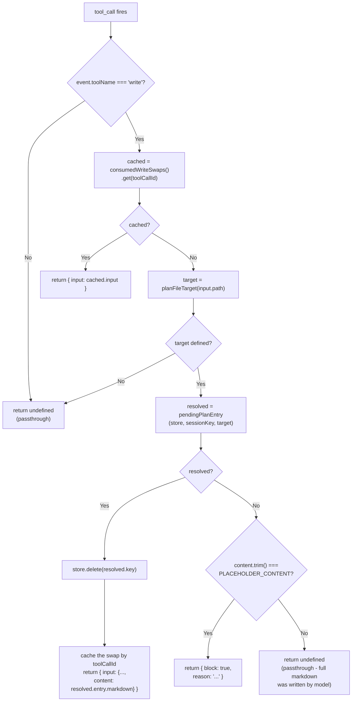

# omp-scribe: Architecture & Patterns

## Overview

**omp-scribe** is a plan-mode cost-reduction extension for oh-my-pi. It splits expensive-model plan authoring into two phases:
1. **Compact phase**: the expensive model emits a compact JSON blueprint — plain metadata plus a **Scribe IR** `files` table and `steps` array of positional tuples (`src/types.ts`) — instead of Markdown prose.
2. **Expansion phase**: `src/scribe-ir.ts` validates that IR, resolves each step's file id to a project-relative path, and hydrates the line range each step references from disk; a cheap model (via nested session) then expands the resulting plain-text brief into the final Markdown.

The extension then transparently swaps the placeholder `write` call content before disk I/O, so the expensive model never generates the plan body itself.

Scribe IR replaced the earlier Tokenized Architectural Diff (TAD) string DSL. TAD encoded one step as `@path/to/file.ext[start-end]{+|!|~}deps(a.ts,b.ts)#snake_case_intent` and leaned on a single anchored regex that needed three follow-up bugfixes — paths containing brackets or parentheses, and single-line range shorthand — while any format tweak had to stay in lock-step across that regex, its human-readable shape string, the tool's Zod schema, the `<scribe>` directive, and the writer prompt. Scribe IR instead rides ordinary JSON tool-call arrays the model already emits reliably, and `validateScribeBlueprint` reports precise per-index/per-field errors (duplicate file id, unknown file id, invalid operation, inverted range, empty string) instead of one generic regex mismatch; explicit `preserve`/`doNot` arrays replace TAD's free-floating `deps(...)` list; and steps that share a file reuse one `files`-table entry instead of repeating the path on every line.

The extension also supports **doc-blueprint mode** (`/scribe-doc`), which reuses the same blueprint-and-expand mechanism — a `DocBlueprint` outline instead of plan steps — for standalone Markdown documents; it is covered later in this document.

**Goal**: reduce tokens spent by the expensive model authoring plan-document prose, leaving all other plan-mode mechanics (approval UI, file destination, native workflow) untouched.

---

## Module Map

### `src/types.ts` — Blueprint Shape (65 lines)

Defines the compact blueprint contract the expensive model submits, for plan mode and doc mode alike. Positional tuples are deliberate: the blueprint is emitted by the expensive model, so repeating object keys would cost tokens, while the semantic content stays explicit prose in `intent`, `preserve`, and `doNot`.

- `ScribeOperation`: `"+" | "!" | "~"` — add / delete / modify.
- `ScribeFile`: readonly `[id, path, reason]` — a file the plan touches. `id` is a short label the `steps` array references, `path` is project-relative, and `reason` is a one-line note on why the file matters.
- `ScribeRange`: readonly `[start, end]` — an inclusive 1-based line range.
- `ScribeStep`: readonly `[fileId, operation, range, intent, preserve, doNot]` — one ordered change step. `range` is `null` when no existing range applies (e.g. a new file); `intent` is a concise natural-language sentence, never an abbreviation; `preserve`/`doNot` may be empty arrays.
- `PlanBlueprint`: `{ slug, title, context, files, steps, verification, assumptions }` — the top-level compact plan blueprint.
- `DocBlueprintSection`: `{ heading, bullets }` — one section of the doc-mode outline.
- `DocBlueprint`: `{ slug, title, path, sections }` — the compact outline the expensive model submits for a standalone long-form document; `path` is the exact write target declared up front (e.g. `"README.md"`).

**Export**: The tuple aliases and interfaces above, no logic. Field names and structure mirror the native plan-document contract (Context, Approach, Critical files, Verification, Assumptions); `files`/`steps` are the Scribe IR that `src/scribe-ir.ts` validates, resolves, and hydrates.

---
### `src/scribe-ir.ts` — Scribe IR Validation and Hydration (176 lines)

**Purpose**: Validate the blueprint's Scribe IR, resolve file ids to paths, and hydrate each step's referenced line range from disk. This is the counterpart to the compact tuple types in `src/types.ts`: the planning model spends tokens on positional tuples, and this module turns them into semantic, human-readable steps the writer model never has to decode.

**Exports**:
- `ScribeLineRange`: `{ start: number; end: number }` — inclusive 1-based line range.
- `ScribeStepResolved`: `{ id, filePath, operation, lineRange, intent, preserve, doNot }` — a step with its file id resolved to a path and a stable `S<n>` id assigned (1-based, in step order); `lineRange` is `undefined` for a new file.
- `HydratedScribeStep`: `{ step: ScribeStepResolved; snippet: string }` — a resolved step plus the file content it references.
- `validateScribeBlueprint(blueprint): void` — Throws a descriptive `Error` naming the offending index and file id on the *first* violation, and never silently repairs malformed IR. Checks, in order: every `files` entry is a 3-element tuple with a non-empty string id, path, and reason, and no id repeats; `steps` is non-empty; every `steps` entry is a 6-element tuple; each `fileId` references a known file; `operation` is one of `+`/`!`/`~`; `range` is `null` or a 2-element `[start, end]` with a positive integer `start` and `end >= start`; `intent` is a non-empty string; every `preserve`/`doNot` entry is a non-empty string. The tool boundary's Zod schema can only assert fixed-length arrays of unknowns, so this is the sole place doing per-position semantic checks.
- `resolveScribeSteps(blueprint): ScribeStepResolved[]` — Maps each step's file id to its path and assigns the stable `S<n>` id. Call only after `validateScribeBlueprint` has passed; it re-checks the file-id reference defensively and throws if it is unknown.
- `hydrateScribeStep(projectRoot, step): Promise<HydratedScribeStep>` — Reads the lines a step references so the writer model can ground its prose in real code. Resolves `step.filePath` against `projectRoot`, refuses paths escaping the project root, reads the file, and returns a 1-based numbered excerpt (e.g., `    1| <line>`). Caps excerpts at 200 lines (`MAX_SNIPPET_LINES`). Never throws: missing files yield `(no snippet: <path> does not exist yet — treat this step as authoring it from scratch)`, a directory gets its own note, other read errors carry their error code, requests starting past EOF are refused with a note, ranges past EOF are capped, omitted trailing lines are noted, and a path outside the project root appends an explanatory note. Ported near-verbatim from the deleted TAD hydrator, so one bad step can never sink a plan.

---


### `src/config.ts` — Flags, Detection, Stores, Contracts (396 lines)

**Purpose**: Configuration management, plan-mode detection, plan/doc-file resolution, per-project writer-model persistence, the footer-status renderer, the process-wide pending-draft singletons, and the host-API contracts.

**Constants & config types**:
- `BLUEPRINT_TOOL_NAME = "propose_plan_blueprint"` / `DOC_BLUEPRINT_TOOL_NAME = "propose_doc_blueprint"`: the two registered tool names (hardcoded everywhere they're needed).
- `PLACEHOLDER_CONTENT = "pending"`: sentinel string; the expensive model writes this literal word as the file content, then the extension swaps it.
- `DEFAULT_WRITER_MODEL = "@smol"`: writer-model spec used when neither the CLI flag nor the per-project override names one.
- `SCRIBE_MODEL_CONFIG_RELATIVE_PATH = ".claude/plans/scribe_config.json"` and `scribeModelConfigPath(cwd)`: the persisted per-project settings file that `/scribe-model` writes.
- `ScribeConfig { brainModel?: string; writerModel: string }`; `PersistedScribeConfig` has every field optional so a patch never has to restate the whole file.

**Configuration interface**:
```ts
ScribeConfig {
  brainModel?: string;     // advisory; warns if active model doesn't match
  writerModel: string;     // defaults to "@smol" role
}
```

**Pending-draft entry**:
```ts
PendingBlueprint {
  sessionKey: string;                                  // originating session, for filtered cleanup
  markdown: string;                                    // the expanded document body
  writerModel: { provider: string; id: string };       // the model that produced it
  writerUsage: { input: number; output: number };
  writerCostUsd: number;
  slug?: string;                                       // doc drafts also carry the blueprint slug
}
```

**Host-API contracts** (how the extension detects plan mode and resolves plan/doc files):
- **Plan-mode detection** (`isPlanModeActive(ctx)`, `isPlanModeBranch(branch)`) — scans `ctx.sessionManager.getBranch()` backwards for the first mode-related entry: a `mode_change` entry (from `SessionManager.appendModeChange`, persisted and read back through `buildSessionContext().mode` and the host's `#reconcileModeFromSession` in `modes/interactive-mode.ts`) determines whether plan mode is active (`mode === "plan"`) or inactive (`"plan_paused"`, `"none"`, `"goal"`, `"vibe"`); or a `custom_message` with `customType === "plan-mode-context"` (from `AgentSession.sendPlanModeContext`) means active (covers `--plan-yolo`, which sets plan state in-session without a `mode_change`); or a `custom_message` with `customType === "plan-yolo-handoff"` means inactive; else defaults to false. The plan brief itself is delivered as a hidden `custom_message`, never in `BeforeAgentStartEvent.systemPrompt`.
- **Plan-file resolution** (`planFileTarget(path)`, `pendingPlanEntry(store, sessionKey, target)`) — `planFileTarget()` matches any `local://*plan.md` artifact (case-insensitive extension, stem charset: letters, numbers, underscores, hyphens, per the host's `normalizePlanTitle()`); returns `{ stem, slug }` where `slug` is defined for the canonical `local://<slug>-plan.md` form and undefined for the default `local://PLAN.md` or custom stems. `pendingPlanEntry()` resolves the draft to consume: it tries exact slug match (case-insensitive) first, then `<slug>-plan` stem match, otherwise the session's only pending draft (which allows `local://PLAN.md` and title-derived names to resolve), otherwise undefined (blocking placeholder writes).
- **Doc-file resolution** (`pendingDocEntry(store, sessionKey, path)`) — doc-mode drafts are keyed by the declared write-target path; the resolver tries an exact path match first, then the session's only pending doc draft (so `./README.md` still matches a declared `README.md`), otherwise undefined (blocking placeholder writes).

**Exports**:

| Name | Purpose | Notes |
|------|---------|-------|
| `registerScribeFlags(pi)` | Registers `--scribe-brain-model` and `--scribe-writer-model` CLI flags. Load-time safe. | Called first in factory. |
| `readScribeConfig(pi, cwd)` | Async. Reads current flag values, then the persisted per-project override; returns `ScribeConfig`. | Idempotent. Writer precedence: non-default flag → `.claude/plans/scribe_config.json` → `DEFAULT_WRITER_MODEL`. |
| `readPersistedScribeConfig(cwd)` / `writePersistedScribeConfig(cwd, patch)` | Read/atomically merge the per-project settings file (`/scribe-model` writes it). | Writes a `.tmp-<pid>-<uuid>` sibling then renames; read failures self-heal to `{}`; `writerModel: undefined` deletes the key. |
| `isPlanModeActive(ctx)` | Wrapper calling `isPlanModeBranch(ctx.sessionManager.getBranch())` with defensive guard for missing `getBranch`. | Detects via session branch; returns false for empty branch, missing context, or inactive modes. |
| `isPlanModeBranch(branch)` | Scans `branch` (array of session entries) backwards for the first mode-related entry; returns true only for `mode_change.mode === "plan"` or `custom_message.customType === "plan-mode-context"`. | Covers both persisted mode changes and in-session `--plan-yolo`. |
| `planFileTarget(path)` | Parses any `local://*plan.md` path; returns `{ stem, slug }` or undefined for non-plan-files. | Slug is defined only for the canonical `<slug>-plan.md` form. |
| `pendingPlanEntry(store, sessionKey, target)` | Resolves which pending plan draft the write should consume: exact slug match, `<slug>-plan` stem match, or the session's only draft; returns `{ key, entry }` or undefined. | Undefined blocks placeholder; unambiguous cases pass through or are consumed. |
| `pendingDocEntry(store, sessionKey, path)` | Same resolution for doc mode: exact declared-path match, or the session's only doc draft; returns `{ key, entry }` or undefined. | Undefined blocks placeholder for an armed session. |
| `pendingMarkdownStore()` / `pendingDocMarkdownStore()` | Process-wide `Map<slug, PendingBlueprint>` (plan) and `Map<path, PendingBlueprint>` (doc) of expanded drafts. | `globalThis`-backed singletons; populated by tool executes, consumed by `tool_call`, cleaned by `session_shutdown`. |
| `consumedWriteSwaps()` | Process-wide `Map<toolCallId, ConsumedWriteSwap>` idempotency cache. | Duplicate handler firings for the same real write converge on one outcome regardless of order. |
| `armedDocSessions()` | Process-wide `Set<sessionKey>` of sessions armed for one doc-mode document. | Toggled by `/scribe-doc`; cleared on consume and shutdown. |
| `docDraftHistory()` | Process-wide `Map<declared path, session key>` of every path a doc blueprint declared this session. | Lets the placeholder guard distinguish "never drafted" from "already drafted and consumed". |
| `resolveWriterModel(ctx, spec)` | Resolves `spec` to a concrete `Model`, falling back to the `@smol` role. | `undefined` only when neither resolves. |
| `sameModel(resolved, current)` | Compares `(provider, id)` pairs; true if identical. | Used for advisory warnings. |
| `ScribeDraftStatus` / `ScribeStatusState` | Draft descriptor and the footer state union: `idle` \| `doc-armed` \| `plan` \| `doc` \| `failed`. | `failed` carries `mode` and a message. |
| `formatScribeStatus(cfg, state)` | Renders the single-line footer text for the current state. | Draft states report the resolved `provider/id` and drafted character count; failure text is capped at 60 chars (`STATUS_MESSAGE_MAX`). |

---

### `src/writer-session.ts` — Nested Expansion Engine (255 lines)

**Purpose**: Spawn a short-lived, tools-free nested session on a cheap model to expand compact blueprints into Markdown.

**Exports**:

- `WRITER_SYSTEM_PROMPT`: Multi-line instruction template for the plan expansion model. It tells the writer it is expanding a "compact implementation-plan IR" — not a syntax it must decode — and that the APPROACH STEPS are authoritative. The brief it describes is labelled plain text (not JSON), with these blocks:
  - `TITLE` — the plan title (becomes the `# ` heading)
  - `CONTEXT` — the ask and intended end state (2–4 sentences)
  - `APPROACH STEPS` — numbered steps; each prints the target file path, `operation: add | delete | modify`, an inclusive line range or `(new file)`, the `intent` sentence, optional `preserve:`/`do not:` lists, and a `source:` excerpt of the referenced lines (or a parenthesised note saying nothing could be read)
  - `FILES` — optional "path — reason" pointers (omit section if absent)
  - `VERIFICATION` — optional concrete check bullets (omit section if absent)
  - `ASSUMPTIONS` — optional user-overridable decisions (omit section if absent)
  It fixes the output contract (`# <TITLE>`, then Context / Approach / Critical files & anchors / Verification / Assumptions & contingencies), demands one bullet per step grounded in the supplied snippet, treats preserve items as hard constraints and do-not items as explicit prohibitions, forbids inferring requirements from the source code, and closes with "You are a renderer, not a planner."

- `DOC_WRITER_SYSTEM_PROMPT`: Multi-line instruction for doc-mode expansion. Receives JSON, emits `# <title>` plus one `## <heading>` per section, expands each bullet list into terse prose, preserves section order, and invents nothing beyond the bullets.

- `ExpandResult = { markdown: string; model: { provider: string; id: string }; usage: { input: number; output: number }; costUsd: number } | { error: string }`: Discriminated union. The success variant carries the writer model's identity, token usage, and cost so `index.ts` can attribute and price the run.

- `runWriterExpansion(pi, ctx, writerModel, systemPrompt, promptText): Promise<ExpandResult>` (private) — Shared nested-session execution helper. Creates a tools-free session on `writerModel`, sends `promptText` verbatim as the user message, accumulates the streamed Markdown response while collecting usage and cost from each assistant `message_end`, and disposes the session in a finally block. Never touches disk.

- `runWriterExpansionWithRetry(pi, ctx, writerModel, systemPrompt, promptText): Promise<ExpandResult>` (private) — Wraps `runWriterExpansion` and retries exactly once with a brand-new nested session when the first attempt errors or returns empty Markdown (both treated as transient), notifying the user of the retry when a UI is present. It is the only entry point the two public expanders call, so an intermittent cheap-model blip never forces the expensive model to draft the Markdown itself.

- `SCRIBE_OPERATION_LABELS` (private): `Record<ScribeOperation, string>` rendering `+`/`!`/`~` as `add`/`delete`/`modify` in the brief.

- `buildPlanPromptText(blueprint, steps): string` — Renders the writer model's user message for a plan: labelled plain text carrying the blueprint's metadata (`TITLE`, `CONTEXT`) plus, for every hydrated `HydratedScribeStep`, its resolved file path, operation label, line range or `(new file)`, intent, non-empty preserve/do-not lists, and the indented `source:` snippet. Blocks the blueprint left empty are omitted, matching `WRITER_SYSTEM_PROMPT`'s omission rule exactly.

- `expandBlueprintToMarkdown(pi, ctx, writerModelSpec, blueprint): Promise<ExpandResult>` — Runs a short-lived, tools-free nested session to expand `blueprint` into the final Markdown plan body.
  - **Inputs**: `pi: ExtensionAPI`, `ctx: ExtensionContext`, `writerModelSpec: string`, `blueprint: PlanBlueprint`.
  - **Returns**: `ExpandResult`.
  - **Key mechanics**:
    1. Resolves `writerModelSpec` via `resolveWriterModel()`; returns an error when nothing resolves.
    2. Validates and resolves the IR: `validateScribeBlueprint(blueprint)` then `resolveScribeSteps(blueprint)`; a validation throw is caught and returned as `{ error }`.
    3. Notifies the user (if UI present) that plan-Markdown drafting is delegating.
    4. Hydrates every resolved step in parallel: `Promise.all(resolvedSteps.map(step => hydrateScribeStep(ctx.cwd, step)))`.
    5. Calls `runWriterExpansionWithRetry()` with `buildPlanPromptText(blueprint, hydrated)`, which sends that brief verbatim to the writer model and returns markdown plus model/usage/cost.

- `expandDocBlueprintToMarkdown(pi, ctx, writerModelSpec, blueprint): Promise<ExpandResult>` — Analogous to the plan version but for `DocBlueprint`. Serializes only the fields the writer needs (`JSON.stringify({ title, sections })`) and delegates to `runWriterExpansionWithRetry()` with `DOC_WRITER_SYSTEM_PROMPT`.

**Error cases**:
- Model resolution fails → `{ error: "No model resolves for writer model…" }`.
- Scribe IR validation fails → `{ error: <descriptive message from validateScribeBlueprint> }` (replaces the old TAD-line parse failure).
- Session creation throws (auth/network) → caught and returned as `{ error }`; a second throw on the retry surfaces that second error.
- Model returns empty text on both the first attempt and the retry → `{ error: "Writer model returned an empty response." }`.

---

### `src/index.ts` — Extension Factory (613 lines)

**Purpose**: Wires all modules; manages lifecycle events, tool registration, cost tracking, footer status, slash commands, state, and the write-content swap.

**Export**: Default factory function `scribe(pi: ExtensionAPI)`.

#### State & Closure

Declared in the factory function body, captured by all event handlers:

```ts
let cfg: ScribeConfig = { brainModel: undefined, writerModel: DEFAULT_WRITER_MODEL };
let lastKnownModels: Model[] = [];         // ctx.models.list() snapshot for /scribe-model
let brainUsage = { input: 0, output: 0 };  // accumulated brain-model tokens this turn
let brainModelId: string | undefined;      // "<provider>/<model>" seen on message_end
let brainCostUsd = 0;                      // accumulated brain-model cost this turn
let brainOutputRatePerMillionUsd = 0;      // brain model's catalog output rate
const sessionKey = (ctx): string => ctx.sessionManager.getSessionId?.() ?? "default";
```

- **`cfg`**: Mutable. Refreshed on every `session_start` and by `/scribe-model`.
- **`lastKnownModels`**: Snapshotted on `session_start`; feeds the `/scribe-model` picker and its argument completions.
- **Cost-tracking quartet** (`brainUsage`, `brainModelId`, `brainCostUsd`, `brainOutputRatePerMillionUsd`): reset on entering plan mode and again after each swap; read by `computeCosts()` when a swap is consumed.
- **`sessionKey(ctx)`**: Unique session identifier (fallback `"default"`), used as the ownership key for the singleton stores, `armedDocSessions()`, and `docDraftHistory()`.

Three helpers sit alongside them: `baseStatus(ctx)` — the mode-implied footer state (`plan`, `doc-armed`, or `idle`) with no draft on hand; `showStatus(ctx, state)` — writes `formatScribeStatus(cfg, state)` to `ctx.ui.setStatus("scribe", …)`, and never writes when `ctx.hasUI` is false; and `planRoleReferenceRates(ctx)` — resolves the `@plan`-role model's `cost.input`/`cost.output` for the unpriced-brain baseline estimate.

#### Event Lifecycle

**Load-time**: `registerScribeFlags(pi)` runs before any handler registration.

**Session start**: reload `cfg` via `readScribeConfig(pi, ctx.cwd)`; snapshot `lastKnownModels = ctx.models.list?.() ?? []`; paint the footer with `showStatus(ctx, baseStatus(ctx))`; notify the writer/brain model in effect when a UI is present. Idempotent; safe on every session.

**Session shutdown**: deletes every entry whose `sessionKey` matches the current session from all five singleton stores — `pendingMarkdownStore()`, `pendingDocMarkdownStore()`, `docDraftHistory()`, `armedDocSessions()`, `consumedWriteSwaps()` — then clears the footer status key.

**Message end**: the brain-model cost accountant. Ignores non-assistant messages and no-ops unless one of the two blueprint tools is currently active (read via `pi.getActiveTools()`); otherwise it folds `event.message.usage.input`/`.output` and `usage.cost?.total` into `brainUsage`/`brainCostUsd`, records `brainModelId` from `provider`/`model`, and refreshes `brainOutputRatePerMillionUsd` from `ctx.models.current()?.cost?.output`.

**Before agent turn**:
- Computes `wantsBlueprintTool = isPlanModeActive(ctx)` and `wantsDocTool = armedDocSessions().has(sessionKey(ctx))`; entering plan mode resets the cost-tracking quartet; repaints the footer.
- Diffes both wants against `pi.getActiveTools()` and, when either differs, applies both additions/removals in a **single** `pi.setActiveTools(nextTools)` call.
- On the transition *into* plan mode only, notifies whether `cfg.writerModel` resolved and to which `provider/id`.
- When `wantsBlueprintTool && cfg.brainModel`, resolves it and warns through `pi.logger.warn` if it differs from `ctx.models.current()` (never switches models; respects native `modelRoles.plan`).
- Appends `SCRIBE_DIRECTIVE` and/or `DOC_SCRIBE_DIRECTIVE` to `event.systemPrompt`, returning `undefined` when neither applies.

#### Tool Registration

Two tools, both `defaultInactive: true`, `approval: "read"`, `strict: true`, `loadMode: "essential"`:

- **`propose_plan_blueprint`** — Zod parameters: `slug` (regex `/^[A-Za-z0-9][A-Za-z0-9_-]*$/`), `title`, `context`, `files: z.array(z.array(z.unknown()).min(3).max(3)).min(1)`, `steps: z.array(z.array(z.unknown()).min(6).max(6)).min(1)`, plus optional `verification`/`assumptions` that `execute` defaults to `[]` before handing the blueprint to the writer model. Zod can only assert fixed-length arrays of unknowns at this boundary, so the per-field Scribe IR semantics live in `validateScribeBlueprint`.
- **`propose_doc_blueprint`** — Zod parameters: `slug` (kebab-case regex), `title`, `path` (exact write target), `sections: z.array(z.object({ heading, bullets: z.array(z.string()).min(1) })).min(1)`.

**Execute handlers**: each calls its matching expander (`expandBlueprintToMarkdown` / `expandDocBlueprintToMarkdown`). On `{ error }` it calls `showStatus(ctx, { kind: "failed", mode, message })` and returns `isError: true` with a message telling the model to draft the document itself. On success it stores a `PendingBlueprint` carrying `sessionKey`, `markdown`, `writerModel`, `writerUsage`, and `writerCostUsd` — into `pendingMarkdownStore()` keyed by `blueprint.slug`, or `pendingDocMarkdownStore()` keyed by the declared `blueprint.path` — then paints the `plan`/`doc` draft footer and returns the drafted character count plus the exact `write` call to make. The doc handler additionally records the path in `docDraftHistory()`.

#### Tool Call Interception

`pi.on("tool_call", …)`:
- **Early exit**: returns `undefined` when `event.toolName !== "write"`.
- **Idempotency**: looks up `consumedWriteSwaps().get(event.toolCallId)` first and replays the cached input, so duplicate handler firings converge on one outcome.
- **Plan-mode path**: `planFileTarget(input.path)` → `pendingPlanEntry(store, sessionKey(ctx), target)`. On a resolved draft: deletes the store entry; computes `computeCosts()` (`pricing.ts`) from the brain cost quartet, the stored writer usage/cost, and `planRoleReferenceRates(ctx)`; builds a `SavingsRunLogEntry` and calls `appendSavingsRun(ctx.cwd, entry)` (`stats-store.ts`) inside a try/catch that logs a warning and never blocks the write; resets the cost quartet; caches the swap by `toolCallId`; repaints the mode-only footer; and returns `{ input: { ...input, content: entry.markdown } }`. When nothing resolves, a `PLACEHOLDER_CONTENT` write is **blocked** with a reason listing this session's pending slugs (or telling the model to call the blueprint tool first); any other content passes through.
- **Doc-mode path**: mirrors the plan path through `pendingDocMarkdownStore()`/`pendingDocEntry()`, additionally clearing `armedDocSessions()` on success. When no draft resolves it honors two distinct placeholder-guard cases: **already consumed** (`docDraftHistory()` records this path for this session → explains that swapping again would overwrite the finalized file, and to re-draft or write the Markdown itself) and **never drafted** (session still armed → tells the model to call the doc tool first). With doc mode disarmed and no draft on hand, the write passes through.

#### Slash Commands

- **`/savings`** — `readStatsFile(ctx.cwd)` → `formatSavingsDashboard(stats)` → `ctx.ui.notify`; renders the actual dual-model cost against the simulated single-brain-model baseline.
- **`/scribe-doc`** — toggles this session's membership in `armedDocSessions()` (arm or disarm for the next standalone document write) and repaints the footer.
- **`/scribe-model`** — `getArgumentCompletions` offers `@smol`, `reset`, and every `lastKnownModels` entry as `provider/id`. `reset` writes `{ writerModel: undefined }` (deleting the key) and restores `DEFAULT_WRITER_MODEL`; a non-empty spec goes through `applyWriterModel()`, which resolves the spec *first* — an unresolvable spec leaves both the persisted file and `cfg` untouched and warns — and otherwise persists it, updates `cfg`, repaints the footer, and notifies. With no argument it opens `ctx.ui.select` over `@smol` plus the authenticated models (seeded to the current writer) when `ctx.hasUI`, otherwise it reports the current writer model instead of blocking on a picker.

---

## Data Flow

The full per-turn flow during plan mode, from `before_agent_start` event through write interception to `xd://propose` submission:

```mermaid
sequenceDiagram
    participant Host as "oh-my-pi Host"
    participant Scribe as "Scribe Extension"
    participant Brain as "Brain (Expensive Model)"
    participant BPTool as "propose_plan_blueprint Tool"
    participant Writer as "Writer Session (@smol)"
    participant NativeWrite as "native write tool"
    participant Propose as "xd://propose (approval)"
    
    Host->>Scribe: before_agent_start(event)
    Scribe->>Scribe: isPlanModeActive(ctx)?
    alt Plan mode detected
        Scribe->>Host: setActiveTools([..., "propose_plan_blueprint"])
        Scribe->>Host: return systemPrompt + SCRIBE_DIRECTIVE
    else Normal mode
        Scribe->>Host: setActiveTools(remove blueprint tool)
        Scribe->>Host: return unchanged
    end
    
    Host->>Brain: systemPrompt with directive
    Brain->>Brain: "Call propose_plan_blueprint with files/steps Scribe IR tuples, then write placeholder"
    
    Brain->>BPTool: tool call: propose_plan_blueprint(blueprint)
    activate BPTool
    BPTool->>Scribe: execute handler(blueprint, ctx)
    activate Scribe
    Scribe->>Scribe: writer model resolved at session_start (flag → persisted → @smol)
    Scribe->>Scribe: validateScribeBlueprint, then resolveScribeSteps (Scribe IR → stable S<n> steps)
    Scribe->>Scribe: hydrate all steps in parallel (Promise.all), reading file snippets from disk
    Scribe->>Scribe: build labelled plain-text prompt: buildPlanPromptText(blueprint, hydrated)
    
    Scribe->>Writer: sdk.createAgentSession(model=cfg.writerModel, tools=[])
    activate Writer
    Writer-->>Scribe: session created
    
    Scribe->>Writer: subscribe to session events
    Scribe->>Writer: activeSession.prompt(promptText) [the labelled plain-text brief]
    
    Writer->>Writer: cheap model expands plain-text brief to Markdown (reads decoded steps + hydrated snippets)
    Writer->>Scribe: message_update event with text_delta
    Scribe->>Scribe: markdown += delta (repeated)
    
    Writer->>Scribe: agent_end event with isTerminal=true
    Scribe->>Scribe: unsubscribe from events and resolve Promise
    Scribe->>Scribe: session.dispose()
    deactivate Writer
    
    Scribe->>Scribe: computeCosts (pricing.ts); appendSavingsRun (stats-store.ts)
    Scribe->>Scribe: pendingMarkdownStore().set(slug, {sessionKey, markdown, writerModel, writerUsage, writerCostUsd})
    Scribe->>BPTool: return success message
    deactivate Scribe
    
    BPTool->>Brain: tool return: Blueprint expansion complete
    deactivate BPTool
    Brain->>NativeWrite: tool call: write(path="local://<slug>-plan.md", content="pending")
    
    NativeWrite->>Host: tool_call event(toolName="write", input)
    Host->>Scribe: tool_call event dispatch
    Scribe->>Scribe: if (toolName !== "write") return
    Scribe->>Scribe: target = planFileTarget(input.path)
    Scribe->>Scribe: if (target) resolved = pendingPlanEntry(store, sessionKey, target)
    Scribe->>Scribe: markdown = resolved?.entry.markdown
    
    alt Cached markdown found
        Scribe->>Scribe: pendingMarkdownStore().delete(resolved.key); cache swap by toolCallId
        Scribe->>Host: return modified input with markdown content
    end
    
    Host->>NativeWrite: write(path, content=expanded Markdown) [2000+ bytes]
    NativeWrite->>NativeWrite: File written
    NativeWrite->>Host: write completes
    
    Host->>Propose: xd://propose submitted (slug, plan file)
    Propose->>Propose: Approval UI shown
```

### Write Interception Decision

The `tool_call` event handler's decision tree for detecting cached markdown and swapping it before the native write tool executes:



The handler also branches into an analogous **doc-mode** path: when the write target is not a plan file, `pendingDocMarkdownStore()`/`pendingDocEntry()` resolve the declared document path, and the two placeholder-guard outcomes above become the doc-specific pair ("already drafted and consumed this session" vs. "never drafted while armed") rather than the pending-slug list.

---

## State Management

### Session Identity

- Each oh-my-pi session has a unique ID obtained via `ctx.sessionManager.getSessionId?.()`; fallback `"default"`.
- It is the ownership key: every pending-draft entry carries its originating `sessionKey`, and `armedDocSessions()`/`docDraftHistory()` are keyed by it directly.

### Process-Wide Singleton Stores

All five pending-draft structures live in `src/config.ts`, each backed by a `globalThis`-namespaced key so every factory invocation — duplicated module imports, hot reloads, stale handler aliases — shares exactly one instance instead of racing private copies:

| Store | Shape | Role |
|-------|-------|------|
| `pendingMarkdownStore()` | `Map<slug, PendingBlueprint>` | plan drafts awaiting their `write` |
| `pendingDocMarkdownStore()` | `Map<declared path, PendingBlueprint>` | doc-mode drafts, keyed by write target |
| `consumedWriteSwaps()` | `Map<toolCallId, ConsumedWriteSwap>` | idempotency cache for duplicate handler firings |
| `armedDocSessions()` | `Set<sessionKey>` | sessions armed for one doc-mode document |
| `docDraftHistory()` | `Map<declared path, sessionKey>` | distinguishes never-drafted from already-consumed |

Keys are slug/path rather than a composite `${sessionId}:${slug}`, so session isolation is enforced at lookup time instead: `pendingPlanEntry()`/`pendingDocEntry()` filter candidates by `entry.sessionKey === sessionKey(ctx)` before matching, letting two concurrent sessions hold same-named drafts without colliding.

### Cache Lifecycle

| Event | Action |
|-------|--------|
| `session_start` | Stores are process-wide; this session owns no entries yet. |
| `blueprint tool execute` | Entry added: slug (plan) or declared path (doc) → `PendingBlueprint`, plus a `docDraftHistory()` record in doc mode. |
| `tool_call (write)` | Entry consumed (`store.delete(resolved.key)`), swap cached by `toolCallId`, cost quartet reset. |
| `session_shutdown` | Every entry whose `entry.sessionKey` matches this session deleted from all five stores; footer cleared. |

### Blueprint Resubmission

If the model calls a blueprint tool twice for the same slug (plan) or declared path (doc) in one session:
- The second call **overwrites** the first entry in the corresponding store.
- This matches normal "you can revise a draft" behavior; no collision error.

### Error Isolation

- Blueprint expansion failure (cheap model error, network failure, `validateScribeBlueprint` throw, etc.): Tool returns `isError: true`; the store is unchanged and the footer records the failure.
- `write` with placeholder but no matching draft: Write is **blocked**, model retries, directed to call the tool first (or told the doc draft was already consumed).
- `write` with real Markdown (tool never called): Passes through, the mode completes, no savings this turn.
- Savings persistence failure: `appendSavingsRun` throws → logged as a warning through `pi.logger.warn`; the swap still proceeds.

---

## oh-my-pi Contracts & Assumptions

### Detected Host APIs

**Required to work:**

| Contract | Source | Used Where |
|----------|--------|-----------|
| `BeforeAgentStartEvent.systemPrompt: string[]` | oh-my-pi `src/extensibility/extensions/types.ts` | `before_agent_start` handler; only used for appending SCRIBE_DIRECTIVE (detection now via session branch) |
| `ExtensionContext.sessionManager.getBranch()` | oh-my-pi session manager | `isPlanModeActive(ctx)` reads the session branch to detect plan-mode state |
| `ToolCallEvent` | oh-my-pi types | `tool_call` event parameter; includes `toolCallId` for idempotent duplicate tracking |
| `WriteToolInput` | oh-my-pi types | Cast of `event.input`; has `.path` and `.content` |
| `ExtensionContext.models.resolve(spec)` | oh-my-pi session context | Resolving writer model |
| `ExtensionContext.models.current()` | oh-my-pi session context | Advisory brainModel warning |
| `ExtensionContext.localProtocolOptions` | oh-my-pi session context | Passing to nested session for `local://` sharing |
| `ExtensionContext.modelRegistry` | oh-my-pi session context | Nested session auth/registry |
| `ExtensionContext.cwd` | oh-my-pi session context | Nested session working directory |
| `pi.pi` namespace (entire SDK) | oh-my-pi extension API | `pi.pi.createAgentSession()`, `AgentRegistry`, `SessionManager` |
| `pi.setActiveTools(names)` | oh-my-pi extension API | Dynamic tool activation/deactivation |
| `pi.getActiveTools()` | oh-my-pi extension API | Reading current tool set |
| `pi.registerFlag()` | oh-my-pi extension API | CLI flag registration |
| `pi.registerTool()` / `pi.registerCommand()` | oh-my-pi extension API | Blueprint tool and slash-command registration |
| `pi.zod` | oh-my-pi extension API | Shared Zod instance for tool parameter schemas |
| `pi.logger.warn()` | oh-my-pi extension API | Advisory brainModel-mismatch warning; savings-persistence failures |
| `ExtensionContext.models.list()` | oh-my-pi session context | `/scribe-model` picker + argument completions |
| `ExtensionContext.hasUI` / `ui.setStatus` / `ui.notify` / `ui.select` | oh-my-pi extension context | Footer status, user notifications, `/scribe-model` picker |
| `ExtensionCommandContext` | oh-my-pi command types | Handler context for `/savings`, `/scribe-doc`, `/scribe-model` |

The `ctx.models` surface backs more than detection: `resolveWriterModel()` calls `ctx.models.resolve(spec) ?? ctx.models.resolve("@smol")` and `sameModel()` compares the `(provider, id)` pair for the advisory warning, while `ctx.models.current()` supplies the brain model's catalog output rate to the cost tracker and `ctx.models.list()` seeds the `/scribe-model` picker. `ExtensionCommandContext` is a closely related host contract: it is what the three command handlers receive, and it is the only place `ctx.ui.select` and `ctx.hasUI` gate the picker.

### Plan-Mode Detection via Session Branch

The extension reads `ctx.sessionManager.getBranch()` to detect plan-mode state:

1. **Mode changes** (persisted): A `mode_change` entry's `mode` field determines state (`mode === "plan"` active; `"plan_paused"`, `"none"`, `"goal"`, `"vibe"` inactive).
2. **In-session plan mode** (`--plan-yolo` without persistence): A `custom_message` with `customType === "plan-mode-context"` signals active; `customType === "plan-yolo-handoff"` signals inactive.
3. **Plan brief delivery**: The plan brief itself is injected as a hidden `custom_message` (never in `BeforeAgentStartEvent.systemPrompt`), allowing the expensive model to access it without marker-string parsing.

If oh-my-pi's plan-mode branch entries or custom message types change, update the constants in `src/config.ts` (`PLAN_MODE_CONTEXT_CUSTOM_TYPE`, `PLAN_MODE_EXITED_CUSTOM_TYPES`).

### Plan-File Resolution via Path Matching

The extension uses `planFileTarget(path)` to match any `local://*plan.md` write target (case-insensitive `.md` extension, stem charset: letters, numbers, underscores, hyphens, per oh-my-pi's `normalizePlanTitle()`). The stem character set is `^[A-Za-z0-9_-]*plan$` (captured in a private `PLAN_FILE_PATH_RE` module constant). If oh-my-pi's plan-file naming or local-protocol path structure changes, update the regex in `src/config.ts` line 22.

---

## Key Patterns

### 1. Closure over Configuration

```ts
let cfg: ScribeConfig = { … };
pi.on("session_start", async (_event, ctx) => {
  cfg = await readScribeConfig(pi, ctx.cwd);
});
```
- Factory captures `cfg` in closure.
- All event handlers access/mutate shared `cfg`.
- Refreshed on session start; safe for multi-session scenarios.

### 2. Process-Wide Singleton Stores with Session-Filtered Lookup

```ts
// config.ts — one instance per process, shared by every factory closure
const PENDING_STORE_KEY = "scribe-extension.pendingBlueprintStore";
export function pendingMarkdownStore(): Map<string, PendingBlueprint> { /* globalThis-backed */ }

// index.ts — keyed by slug (plan) or declared path (doc); ownership lives in the entry
pendingMarkdownStore().set(blueprint.slug, { sessionKey: sessionKey(ctx), markdown, /* … */ });
pendingDocMarkdownStore().set(blueprint.path, { sessionKey: sessionKey(ctx), markdown, /* … */ });
```
- `globalThis`-namespaced keys mean duplicated module imports and hot reloads still share exactly one store, so a draft written through one factory closure is visible to another.
- Session isolation is enforced at lookup time: `pendingPlanEntry()`/`pendingDocEntry()` filter candidates by `entry.sessionKey` before matching the key.
- Consumption is exactly-once (`store.delete(resolved.key)`), and `session_shutdown` deletes this session's entries from all five stores.
- No external storage; memory-only.

### 3. Declarative Tool Lifecycle

```ts
defaultInactive: true
pi.on("before_agent_start", …) {
  if (wantsBlueprintTool) {
    await pi.setActiveTools([…, BLUEPRINT_TOOL_NAME])
  } else {
    await pi.setActiveTools([…].filter(name => name !== BLUEPRINT_TOOL_NAME))
  }
}
```
- Tool is registered once; activated/deactivated per turn.
- Clean per-turn control without re-registering.

### 4. Event Interception and Input Mutation

```ts
pi.on("tool_call", async (event: ToolCallEvent, ctx) => {
  // … validation/cache lookup …
  return { input: { ...input, content: markdown } };  // Mutate input
})
```
- Early returns for no-op cases (non-write tools, non-plan files).
- Return modified `input` to replace what the model authored.
- Undefined return = pass through unmodified.
- Block with `{ block: true, reason }` to prevent errors (placeholder guard).

### 5. Nested Session for Token Isolation

```ts
const agentRegistry = new sdk.AgentRegistry();  // Private per call
const created = await sdk.createAgentSession({
  agentRegistry,
  localProtocolOptions: ctx.localProtocolOptions,
  toolNames: [],
  restrictToolNames: true,
  enableMCP: false,
  enableLsp: false,
});
```
- Private registry avoids polluting host's global agent registry.
- Shared `localProtocolOptions` enables `local://` protocol handoff.
- Restricted toolset (empty) forces text-only response.
- No external services (MCP/LSP) for speed.

### 6. Discriminated Union for Error Handling

```ts
export type ExpandResult =
  | { markdown: string; model: { provider: string; id: string }; usage: { input: number; output: number }; costUsd: number }
  | { error: string };

if ("error" in result) {
  // error case
} else {
  // success case: result.markdown, result.model, result.usage, result.costUsd
}
```
- Type-safe error distinction; no null/undefined ambiguity.
- Caller forced to handle both paths.
- The success variant is not just the text: it carries the writer model's identity, token usage, and cost, which is what lets `index.ts` attribute the draft in the footer and price the run through `computeCosts()`.

### 7. Minimal Directive Injection

```ts
const SCRIBE_DIRECTIVE = `<scribe>
Cost control is active for this plan turn. Do NOT compose the Markdown plan document yourself.
1. Call \`${BLUEPRINT_TOOL_NAME}\` exactly once with a compact JSON object (no prose, no Markdown) covering slug/title/context/verification/assumptions, plus \`files\` and \`steps\` arrays:
   files entries are [id, path, reason] — id is a short label (e.g. "A"), path is project-relative, reason is one line on why the file matters.
   steps entries are [fileId, operation, range, intent, preserve, doNot]:
   - \`fileId\` — must match an id in \`files\`.
   - \`operation\` — "+" add, "!" delete, "~" modify.
   - \`range\` — [startLine, endLine] inclusive 1-based, or null when no existing range applies (e.g. a new file).
   - \`intent\` — a concise natural-language sentence describing the change; never an abbreviation or code.
   - \`preserve\` — array of things that must keep working; empty array when none.
   - \`doNot\` — array of explicit prohibitions; empty array when none.
   Never paste file content or line bodies into a step: the extension reads the referenced range from disk for the writer model.
   Example: files: [["A","src/auth.ts","password validation and cookie handling"]], steps: [["A","~",[42,67],"Validate the configured production password and issue the existing cookie.",["preserve the existing cookie format"],["do not modify admin authentication"]]].
2. After it returns, call \`write\` with path \`local://<slug>-plan.md\` … and content exactly the single word \`${PLACEHOLDER_CONTENT}\` …
3. Then continue the normal \`xd://propose\` submission with that slug, as usual.
Never draft the Markdown plan body yourself, at any point in this turn. If \`${BLUEPRINT_TOOL_NAME}\` reports a failure, write the plan Markdown yourself with \`write\` and continue — never the placeholder word.
</scribe>`;

return { systemPrompt: [...event.systemPrompt, SCRIBE_DIRECTIVE] };
```
- Single instruction block appended to existing prompts.
- Uses XML-like tags for clarity (mirroring oh-my-pi's own prompt structures).
- Explicit, numbered steps guide model behavior — including the exact `files`/`steps` tuple shape and a worked one-step example, so the model never has to infer the IR or guess at field order.
- Does not modify existing prompts; purely additive.
- `DOC_SCRIBE_DIRECTIVE` follows the same additive-injection pattern for doc mode: call `propose_doc_blueprint` exactly once, then `write` the declared path with the placeholder, and never compose the document body directly.

### 8. Single-Retry Around a Nested-Session Expansion

```ts
async function runWriterExpansionWithRetry(pi, ctx, writerModel, systemPrompt, promptText): Promise<ExpandResult> {
  const first = await runWriterExpansion(pi, ctx, writerModel, systemPrompt, promptText);
  if (!("error" in first)) return first;
  if (ctx.hasUI) {
    ctx.ui.notify(`Scribe: writer model failed (${first.error}); retrying with a fresh session.`, "warning");
  }
  return runWriterExpansion(pi, ctx, writerModel, systemPrompt, promptText);
}
```
- Treats both a thrown session error and an empty completion as transient, granting exactly one retry with a brand-new nested session.
- Keeps an intermittent cheap-model failure invisible to the expensive planning model, which would otherwise be told to draft the Markdown itself.
- Bounded: one retry only, so a genuinely broken writer model still surfaces its error promptly.
- The public expanders call only this wrapper, so the retry policy is stated once rather than duplicated in both paths.

---

## Contract Violations & Error Paths

| Scenario | Detection | Response | Outcome |
|----------|-----------|----------|---------|
| Writer model fails to resolve | `expandBlueprintToMarkdown` returns `{ error }` | Tool returns `isError: true` | Plan incomplete; model can retry or fallback |
| Scribe IR validation fails | `validateScribeBlueprint` throws (non-3/6-element tuple, duplicate or unknown file id, invalid operation, inverted range, empty string) | `expandBlueprintToMarkdown` catches the throw and returns `{ error }`; tool returns `isError: true` | Model sees the offending index and file id, and can resubmit valid IR or write the Markdown itself |
| Cheap model returns empty text | `markdown.trim() === ""` | `runWriterExpansionWithRetry` retries once with a fresh session; on a second empty response returns `{ error: "…empty response…" }` | Model alerted only after the retry also fails; can resubmit the blueprint |
| `write` called with placeholder but no pending entry | `planFileTarget(path)` defined but `pendingPlanEntry(...) === undefined` | `tool_call` blocks with reason listing pending slugs | Write prevented; model instructed to call tool or write the correct slug |
| `write` called with placeholder after a doc draft was consumed | `docDraftHistory().get(path) === sessionKey` | `tool_call` blocks, explaining the finalized file would be overwritten | Model re-drafts via the doc tool or writes the Markdown itself; no clobber |
| `write` called with placeholder while doc mode is armed but nothing drafted | `armedDocSessions().has(key)` and `pendingDocEntry(...) === undefined` | `tool_call` blocks with the "call the doc blueprint tool first" reason | Write prevented; model instructed to draft before writing |
| `write` called to non-plan-file path | `planFileTarget(path) === undefined` | `tool_call` falls through to the doc-mode check, then returns `undefined` | Native write tool handles; no interference |
| `write` called with real Markdown (tool never called) | Store miss but content ≠ placeholder | `tool_call` returns `undefined` (no-op) | Markdown passes through; no token savings, the mode completes normally |
| Savings persistence fails | `appendSavingsRun` throws | Logged through `pi.logger.warn`; the swap is still returned | No user-visible failure; the run is simply not recorded |
| Empty session branch or missing `getBranch()` | `ctx.sessionManager.getBranch()` unavailable or returns empty array | `isPlanModeActive(ctx)` returns false | Defaults to non-plan mode; blueprint tool not activated |
| Plan mode inactive (paused/none/goal/vibe/yolo-handoff) | Session branch has non-plan `mode_change` or `plan-yolo-handoff` `custom_message` | `isPlanModeActive(ctx)` returns false | Blueprint tool not activated; normal mode behavior |
| Two blueprints for the same slug (plan) or path (doc) in one session | Model calls the tool twice | Second call overwrites the entry in `pendingMarkdownStore()`/`pendingDocMarkdownStore()` | Last submission wins; draft revision allowed |

---

## Dependencies & Versioning

| Dependency | Version | Runtime/DevOnly | Role |
|------------|---------|-----------------|------|
| `@oh-my-pi/pi-coding-agent` | `^18.1.11` | **DevOnly** (types only) | TypeScript type definitions; NOT imported at runtime |
| `@oh-my-pi/pi-catalog` | (via pi-coding-agent) | **DevOnly** (types only) | `Model` type for `sameModel()` |
| `typescript` | `^5.7.0` | **DevOnly** | Compilation only |
| (host oh-my-pi) | runtime-injected | **Runtime** | `pi: ExtensionAPI` injected by host at load time |

**Critical note**: `@oh-my-pi/pi-coding-agent` is DevDependency only. The extension uses the host-injected `pi.pi` namespace at runtime, not a direct import. Importing directly would load a second copy with diverged singleton state (breaking nested-session `local://` handoff).

---

## Future Maintenance Points

### If oh-my-pi plan-mode detection changes:
Update `PLAN_MODE_CONTEXT_CUSTOM_TYPE` (line 26) and `PLAN_MODE_EXITED_CUSTOM_TYPES` (line 30) in `src/config.ts` to match the new custom message types, or modify `isPlanModeBranch()` if the session-branch entry types change.

### If oh-my-pi plan-file naming convention changes:
Update the private `PLAN_FILE_PATH_RE` regex in `src/config.ts` line 22 to match the new path format; the regex capture charset is `^[A-Za-z0-9_-]*plan$` (stem ending in 'plan').

### If writer-model prompt tuning is needed:
Edit `WRITER_SYSTEM_PROMPT` in `src/writer-session.ts`. The prompt dictates how the plan brief (decoded steps plus hydrated snippets) and the doc-mode JSON outline are expanded; this is the lever for output style/accuracy. The plan-mode step wire format itself is the `PlanBlueprint`/`ScribeStep` tuple shapes in `src/types.ts`, enforced by `validateScribeBlueprint` in `src/scribe-ir.ts` — a format change must keep that validator, the `<scribe>` directive in `src/index.ts`, and this prompt in lock-step.

### If the pending-drafts store mechanism needs to change:
- The five process-wide singletons — `pendingMarkdownStore()`, `pendingDocMarkdownStore()`, `consumedWriteSwaps()`, `armedDocSessions()`, and `docDraftHistory()` — are stored on `globalThis` under namespaced keys; the persistence strategy can be changed without affecting the extension's event handlers.
- The `toolCallId`-based idempotency cache (`consumedWriteSwaps()`) ensures duplicate handler firings (e.g., from stale handler aliases) converge on one outcome.
- `pendingPlanEntry()` resolution logic (exact slug, stem, or single-draft fallback) and `pendingDocEntry()`'s (exact path, or single-draft fallback) can be made more/less strict if needed.
- `docDraftHistory()` is what separates "already consumed" from "never drafted" in the doc placeholder guard; removing it would collapse those two messages into one.

### If tool activation logic needs refinement:
The `before_agent_start` handler calls `isPlanModeActive(ctx)` to decide whether to activate the blueprint tool. Modify this check or the activation logic if plan-mode detection strategy changes.

---

## Summary: Roles & Interfaces

| Module | Lines | Role | Key Exports |
|--------|-------|------|-------------|
| `types.ts` | 65 | Blueprint and Scribe IR tuple types | `ScribeOperation`, `ScribeFile`, `ScribeRange`, `ScribeStep`, `PlanBlueprint`, `DocBlueprintSection`, `DocBlueprint` |
| `scribe-ir.ts` | 176 | Scribe IR validation, resolution, and disk hydration | `ScribeLineRange`, `ScribeStepResolved`, `HydratedScribeStep`, `validateScribeBlueprint()`, `resolveScribeSteps()`, `hydrateScribeStep()` |
| `config.ts` | 396 | Configuration, detection, persistence, stores, status, contracts | `BLUEPRINT_TOOL_NAME`, `DOC_BLUEPRINT_TOOL_NAME`, `PLACEHOLDER_CONTENT`, `DEFAULT_WRITER_MODEL`, `isPlanModeActive()`, `isPlanModeBranch()`, `planFileTarget()`, `pendingPlanEntry()`, `pendingDocEntry()`, `readScribeConfig()`, `readPersistedScribeConfig()`, `writePersistedScribeConfig()`, `resolveWriterModel()`, `sameModel()`, `formatScribeStatus()`, the five singleton store accessors |
| `writer-session.ts` | 255 | Nested session expansion | `WRITER_SYSTEM_PROMPT`, `DOC_WRITER_SYSTEM_PROMPT`, `buildPlanPromptText()`, `expandBlueprintToMarkdown()`, `expandDocBlueprintToMarkdown()`, `ExpandResult` |
| `pricing.ts` | 88 | Dual-model cost math | `computeCosts()`, `CostComputationInput`, `CostComputationResult` |
| `stats-store.ts` | 242 | Savings run persistence + dashboard | `readStatsFile()`, `appendSavingsRun()`, `formatSavingsDashboard()`, `SavingsRunLogEntry` |
| `index.ts` | 613 | Extension factory, lifecycle wiring | `scribe()` (default export); manages events, both blueprint tools, the three slash commands, footer status, cost tracking, state, and the write swap |

**Total: ~1835 lines across these seven modules.**
